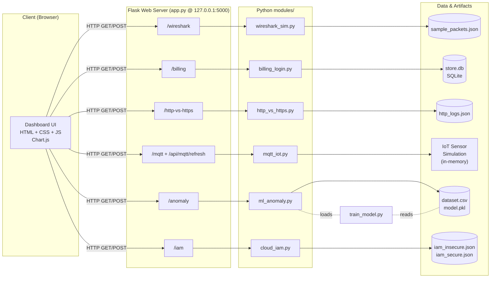
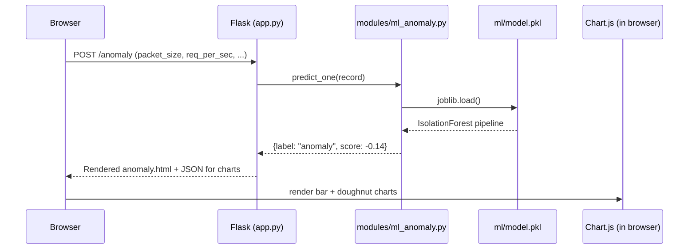
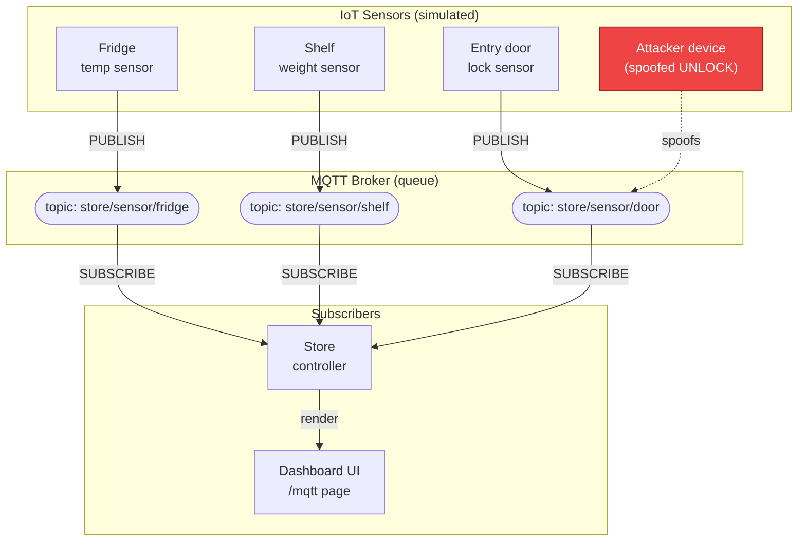
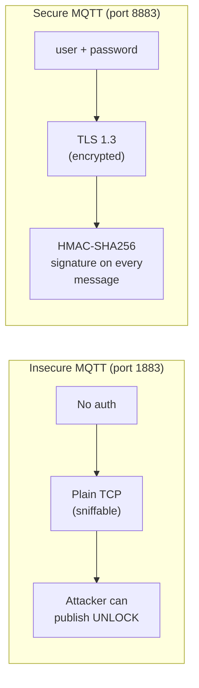

# Architecture – Smart Retail Store Security Audit

This document describes how the 6 modules fit together, and where the
**message queue** (MQTT) sits in the system.

---

## 1. High-level system architecture



---

## 2. Request / response flow (what happens on one click)

Example: user opens **/anomaly** and submits the "Predict" form.



The flow for the other modules is identical, just with a different
Python module on the server side.

---

## 3. MQTT queue architecture (Module 4)

This is where the **queue** (publish/subscribe message broker) lives in
the project.



### Insecure vs. secure queue



---

## 4. One-page file layout

```
Browser (port 5000)
        │
        ▼
┌────────────────────────┐
│   Flask app.py         │
│   (routes + templates) │
└─────┬──────────────────┘
      │
      ├── modules/wireshark_sim.py ──► data/sample_packets.json
      ├── modules/billing_login.py ──► database/store.db  (SQLite)
      ├── modules/http_vs_https.py ──► data/http_logs.json + hashlib
      ├── modules/mqtt_iot.py      ──► in-memory pub/sub simulation
      ├── modules/ml_anomaly.py    ──► ml/model.pkl  ◄── train_model.py
      └── modules/cloud_iam.py     ──► data/iam_insecure.json
                                      data/iam_secure.json
```
